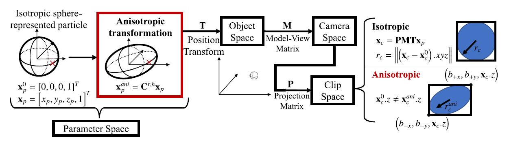
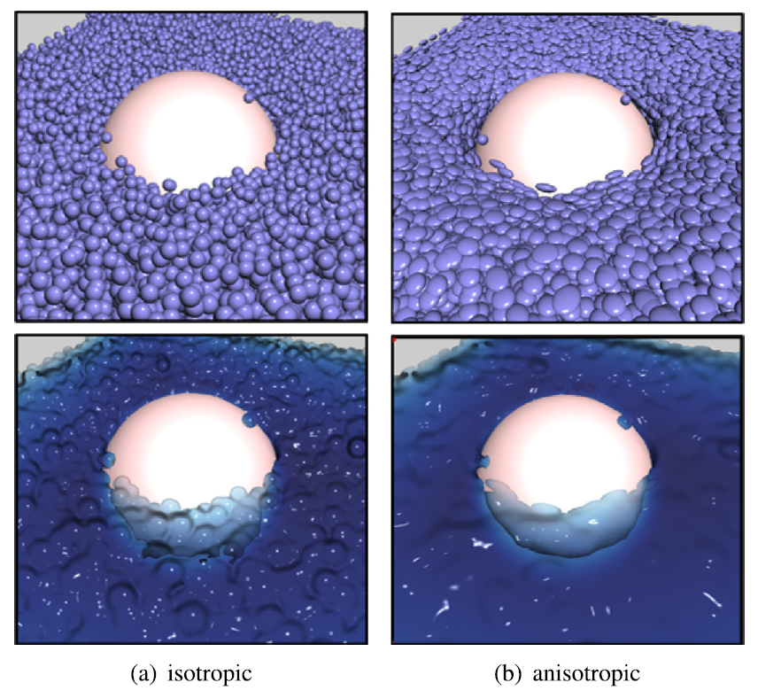
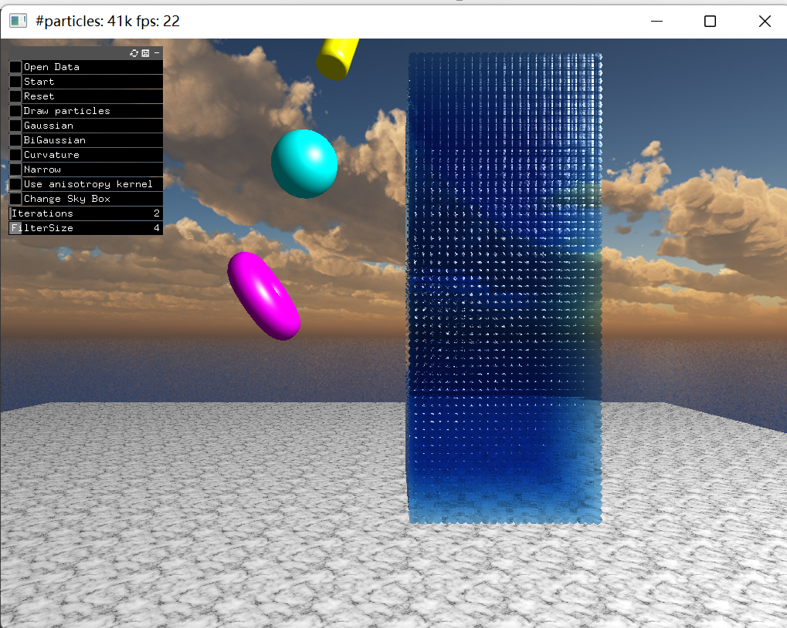

# Anisotropic screen space rendering for particle-based fluid simulation

## \[[PDF](https://doi.org/10.1016/j.cag.2022.12.007)\] \[[Data](https://drive.google.com/drive/folders/1YMprOUjOw7R3LOgXPa7TQbo6k3usWQbN?usp=sharing)\]

We propose a real-time fluid [rendering](https://www.sciencedirect.com/topics/computer-science/rendering) method based on the screen space rendering scheme for particle-based [fluid simulation](https://www.sciencedirect.com/topics/computer-science/fluid-simulation). Our method applies anisotropic transformations to the point sprites to stretch the point sprites along appropriate axes, obtaining smooth fluid surfaces based on the weighted principal components analysis of the particle distribution. Then we combine the processed anisotropic point sprite information with popular screen space filters like curvature flow and narrow-range filters to process the depth information. Experiments show that the proposed method can efficiently resolve the issues of jagged edges and unevenness on the surface that existed in previous methods while preserving sharp high-frequency details.



## Dependencies

`visual studio community 2022` or higher.

Download the **openframeworks** and go into the **apps/myApps** folder. Just clone this repository. 

The structure should look like the following:

```
apps
  └─myApps
      ├─emptyExample
      └─ZSphRenderer
```

Also, you need to add **Threading Building Blocks(TBB)** extension for openframeworks

For simplicity, you can download `ofxTBB.zip` from this [Google Drive](https://drive.google.com/drive/folders/1YMprOUjOw7R3LOgXPa7TQbo6k3usWQbN?usp=sharing) and extract it to `openframeworks/addons/` folder

## Download the simulation data

Download `FluidSim2.zip` from this [Google Drive](https://drive.google.com/drive/folders/1YMprOUjOw7R3LOgXPa7TQbo6k3usWQbN?usp=sharing). Unzip it to the `${ProjectDir}/data/`  dir.

The structure should look like the following:

```
data
  └─FluidSim2
    ├─FluidFrame
    ├─SolidFrame
    └─viz_info.txt
```



## Compile the project

open the `ZSphRenderer.sln` build and run.

If any compilation error occurs, please make sure that the header file paths are configured correctly

After running this program, you will see the following window:



Click `Start` button to start rendering simulation. 

By clicking different buttons in the menu, you can choose different rendering methods for comparison
